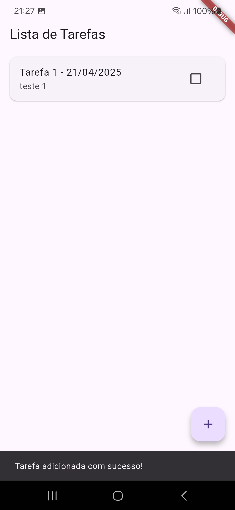
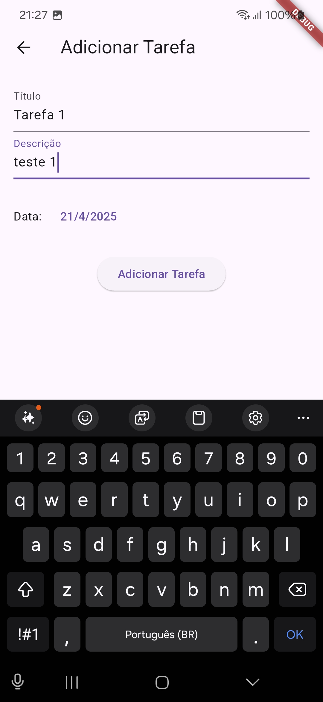
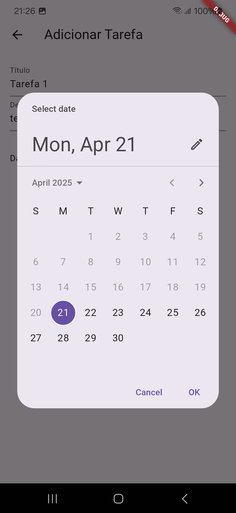
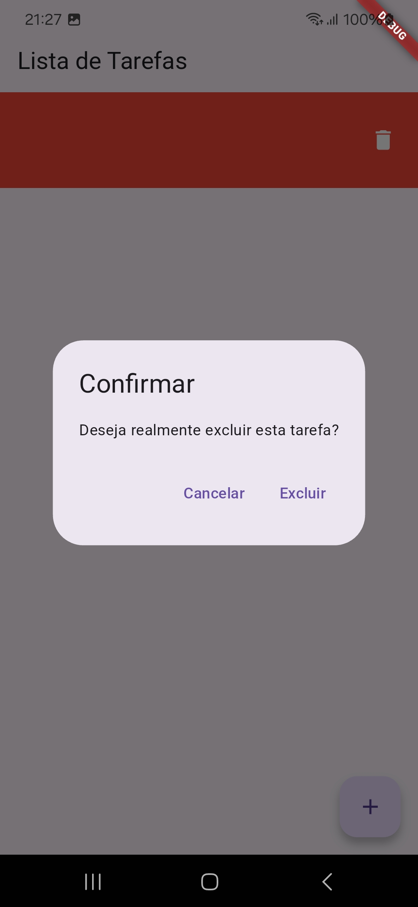

# Lista de Tarefas

Um aplicativo Flutter para gerenciar tarefas, utilizando SQLite como banco de dados local e Provider para gerenciamento de estado. O aplicativo permite criar, listar, editar, marcar como concluídas e excluir tarefas.

Screens
<table>
  <tr>
    <td></td>
    <td></td>
    <td></td>
    <td></td>
  </tr>
</table>

## Funcionalidades

- **Adicionar Tarefa**: Crie novas tarefas com título, descrição e data.
- **Listar Tarefas**: Exibe todas as tarefas cadastradas em uma lista.
- **Editar Tarefa**: Permite editar os detalhes de uma tarefa existente.
- **Excluir Tarefa**: Remova tarefas da lista com confirmação.
- **Marcar como Concluída**: Marque tarefas como concluídas ou pendentes.
- **Persistência Local**: Todas as tarefas são armazenadas localmente usando SQLite.
- **Atualização Reativa**: A lista de tarefas é atualizada automaticamente com o uso do Provider.

## Estrutura do Projeto

- **`lib/main.dart`**: Configuração inicial do aplicativo e integração com o Provider.
- **`lib/screens/home_screen.dart`**: Tela principal que exibe a lista de tarefas.
- **`lib/screens/add_task_screen.dart`**: Tela para adicionar ou editar tarefas.
- **`lib/widgets/task_list.dart`**: Widget que exibe a lista de tarefas com suporte a exclusão e marcação de conclusão.
- **`lib/providers/task_provider.dart`**: Gerenciamento de estado e integração com o banco de dados.
- **`lib/database/database_helper.dart`**: Classe responsável por interagir com o banco de dados SQLite.
- **`lib/models/task.dart`**: Modelo de dados para representar uma tarefa.

## Tecnologias Utilizadas

- **Flutter**: Framework para desenvolvimento do aplicativo.
- **SQLite**: Banco de dados local para persistência de tarefas.
- **Provider**: Gerenciamento de estado reativo.
- **Intl**: Formatação de datas.

## Como Executar

1. **Clone o repositório**:
```bash
 git clone <URL_DO_REPOSITORIO>
 cd task_list
```

## Instale as dependências:
```
flutter pub get
```

## Execute o aplicativo:
```
flutter run
```

## Estrutura da Interface
Tela Principal (Lista de Tarefas)
- Exibe uma lista de tarefas com título, descrição e data.
- Permite marcar tarefas como concluídas ou excluí-las com um deslizar.

Tela de Adicionar/Editar Tarefa
- Formulário para adicionar ou editar uma tarefa.
- Campos para título, descrição e data.

## Gerenciamento de Estado
O estado do aplicativo é gerenciado com o Provider. A classe TaskProvider é responsável por:

- Carregar tarefas do banco de dados.
- Adicionar, editar e excluir tarefas.
- Atualizar a interface de forma reativa.

## Banco de Dados
O banco de dados SQLite é gerenciado pela classe DatabaseHelper. Ele contém métodos para:

- Inserir novas tarefas.
- Consultar todas as tarefas.
- Atualizar tarefas existentes.
- Excluir tarefas.

## Contribuição
Contribuições são bem-vindas! Sinta-se à vontade para abrir issues ou enviar pull requests.